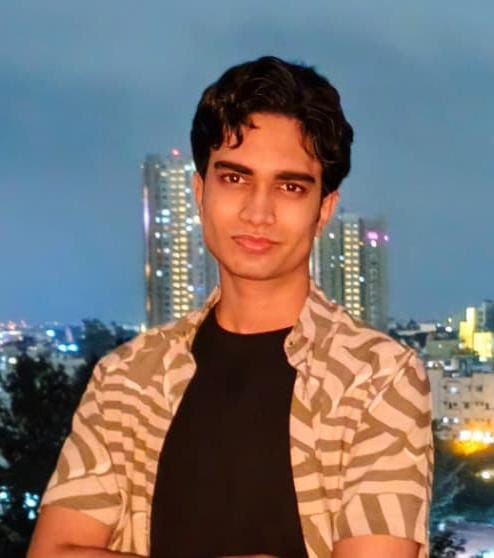

# About Me

**CS Freshman | Computer Systems**

I am a **Computer Science freshman** at **SRMIST Kattankulathur**, currently focused on **deepening my knowledge in C** and **learning Python**. I am keenly looking forward to exploring **C++** and diving into **Machine Learning** while actively working on relevant projects.

# Projects

**Chess Engine (In Progress)**
* Developing a chess program written purely in C.
* Focusing on efficient move generation and board representation.

**Attendance Calculator**
* A C-based tool to track and predict university attendance margins.

# Skills

* **Languages:** C, Python, C++ (Planning)
* **Interests:** Machine Learning, Computer Systems
* **Tools:** Linux, Neovim, Hyprland, Git

---

> "Those who can't hear the music think the dancers are insane."
